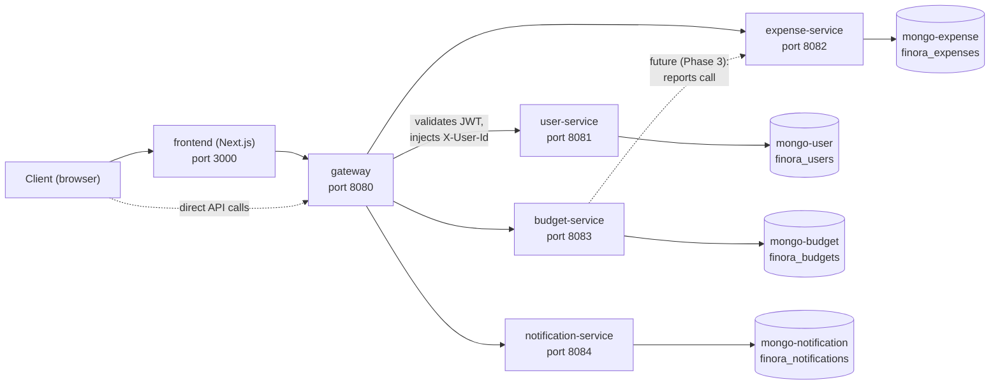

# Finora

Finora is a personal-finance SaaS: register, log in, track accounts and transactions, set budgets and savings goals, get notified, view reports. It looks and works like a real fintech product.

That is the surface. The actual reason Finora exists is different: **it is a long-term learning platform for Kubernetes, DevOps, and platform engineering**, built on top of a realistic distributed application so that every infrastructure concept — deployment, scaling, networking, observability, secrets, progressive delivery — has a genuine, non-trivial system to practice on instead of a toy "hello world" service.

The split of ownership reflects that:

- **Application code** (Go/Gin microservices, Next.js frontend) is written to be easy to deploy and operate — clean architecture, one Mongo per service, structured logging, Kubernetes-shaped health checks, env-var-only config, no hidden state.
- **Infrastructure** (Docker, Kubernetes, Helm, GitHub Actions, Argo CD, networking, monitoring, logging, secrets, scaling, security, deployment) is owned and evolved by the repo maintainer as a hands-on DevOps practice ground.

See `architecture/system-overview.md` for the full rationale, and `architecture/development-roadmap.md` for where the project is headed.

## Architecture



The gateway is the only component that validates JWTs and the only one exposed for API traffic alongside the frontend. Each service owns exactly one MongoDB database — no service ever queries another service's database directly. Full contract details (routes, envelope shape, auth headers) live in `architecture/api-contracts.md`.

## Quickstart

```bash
git clone <this-repo>
cd finora
cp .env.example .env
docker compose up --build
```

This brings up the gateway, all four services, their four MongoDB instances, and the frontend, wired together on one Docker network. Once every container reports healthy:

- Frontend: http://localhost:3000
- API (via gateway): http://localhost:8080/api/v1/...
- Gateway health: http://localhost:8080/health

See `docs/local-development.md` for the full workflow (including a native, non-Docker per-service option), a sample end-to-end curl flow (register → login → `/users/me` → refresh), and the **Testing** section (`make test` for fast fake-backed unit tests, `make test-integration` for real-Mongo integration tests via testcontainers — Phase 6).

> Note: `docker-compose.yml` is one of the last pieces wired up in the build process for this repository. If you're reading this before it lands, the workflow above is the documented target — check `docker compose config` or the repo root for its current status.

## Services & Ports

| Service | Responsibility | Container port | Host port | Its MongoDB |
|---|---|---|---|---|
| `frontend` | Next.js UI | 3000 | 3000 | — |
| `gateway` | JWT validation, reverse proxy, CORS, request-id | 8080 | 8080 | — (owns no data) |
| `user-service` | Auth, user profile, settings | 8081 | 8081 | `mongo-user` (27017) |
| `expense-service` | Accounts, transactions, categories | 8082 | 8082 | `mongo-expense` (27018) |
| `budget-service` | Budgets, savings goals, reports | 8083 | 8083 | `mongo-budget` (27019) |
| `notification-service` | In-app notifications | 8084 | 8084 | `mongo-notification` (27020) |

Only the gateway and frontend ports are meant to be called by clients; service ports are exposed to the host for local debugging only and are ClusterIP-only once this runs in Kubernetes. Full port table and endpoint list: `architecture/api-contracts.md`.

## Documentation Map

| Read this | For |
|---|---|
| `CLAUDE.md` | Project constitution — standards, boundaries, Definition of Done |
| `architecture/system-overview.md` | Goals, component diagram, tech-choice rationale, future evolution |
| `architecture/service-boundaries.md` | What each service owns and is forbidden from doing |
| `architecture/api-contracts.md` | The HTTP contract every service must conform to |
| `architecture/database-design.md` | Per-service schema, indexes, the one-Mongo-per-service rule |
| `architecture/repository-structure.md` | Monorepo layout, Go module strategy, Docker build-context convention |
| `architecture/development-roadmap.md` | Phase 0–9 plan to a fully-working Finora |
| `docs/local-development.md` | Running this locally, health checks, troubleshooting |
