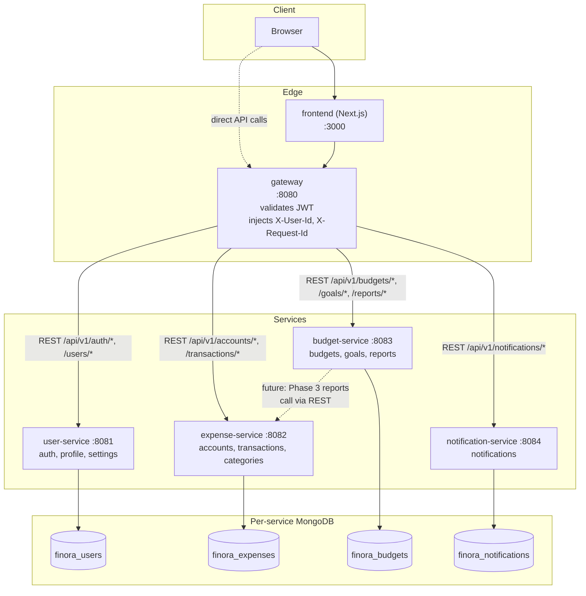

# System Overview

## Purpose

Finora has two goals, and the second is the real one:

1. **Product goal:** a realistic personal-finance SaaS — registration, JWT auth, accounts, transactions, budgets, savings goals, notifications, reports.
2. **Platform goal (the actual point):** a long-lived, production-shaped distributed system for practicing Kubernetes, Docker, CI/CD, Argo CD, networking, monitoring, logging, secrets management, scaling, and security — the full DevOps/platform-engineering skill set — against something more realistic than a "hello world" microservice.

Every architectural decision in this repo is evaluated against the second goal first: **does this make the system easier to deploy, observe, scale, and operate later?** The business domain (finance) exists to give that infrastructure something non-trivial and relatable to run.

Ownership is split accordingly: application code (this repo's Go services + Next.js frontend) is written and evolved by an AI engineering session whose job is to make the app trivially deployable; everything under `infrastructure/` (Docker, Kubernetes, Helm, CI/CD, Argo CD, networking, observability, secrets, scaling, security) is owned by the repo maintainer, a DevOps/Platform Engineer, not a software engineer.

## Component & Data-Flow Diagram

**Request flow for a protected call** (e.g. `GET /api/v1/accounts`):

1. Client sends `Authorization: Bearer <access_token>` to the gateway.
2. Gateway validates the token via `shared/jwtx.Parse` (HS256, `JWT_ACCESS_SECRET`), extracts `sub` (user id).
3. Gateway forwards the request to `expense-service` with `X-User-Id` and `X-Request-Id` headers set, no Authorization header needed downstream.
4. `expense-service` requires `X-User-Id` (via `shared/middleware.RequireIdentity`) and scopes every query to that user id.
5. Response flows back through the gateway to the client, wrapped in the standard envelope from `shared/httpx`.

Public routes (`register`, `login`, `refresh`) bypass step 2/4's identity requirement by design — see `architecture/api-contracts.md`.

## Tech Choices & Rationale

| Choice | Why | Rejected alternative(s) & why |
|---|---|---|
| **Go + Gin** for services | Small static binaries (fast container builds, small images, no runtime to patch), excellent concurrency for I/O-bound REST services, Gin is a thin, well-understood router/middleware layer that doesn't fight Clean Architecture. | Node/Express: weaker static typing story without heavy tooling. A "batteries-included" framework (e.g. NestJS): more magic/DI machinery than this project's scale justifies — `plan.md` explicitly says avoid unnecessary complexity. |
| **Next.js (App Router, TypeScript)** for frontend | Industry-standard React meta-framework; App Router gives file-based routing and server components out of the box; TypeScript catches integration bugs against the envelope contract at compile time. | A plain SPA (Vite + React): would need hand-rolled routing/SSR decisions with no real benefit here. |
| **MongoDB, one instance per service** | Document model fits evolving finance schemas (transactions, settings) without migrations for every field; per-service instances physically enforce "never share a DB" and map 1:1 onto a per-service StatefulSet in Kubernetes later. | A single shared Postgres/Mongo instance with per-service schemas or DB users: cheaper to run locally, but only a *social* boundary, not a physical one — one bad query or shared credential and the isolation is gone. Isolation and future StatefulSet-per-service parity won here; see `architecture/database-design.md` for the full trade-off. |
| **`log/slog` (JSON handler), stdlib** | Zero external dependency, ships in Go 1.21+, structured JSON out of the box, trivially swappable behind the same `shared/logger.New` call if a richer logger is ever needed. Every line: `ts`, `level`, `service`, `request_id`, `msg`, and `error` when applicable — ready for Loki/any log shipper with no app changes (see Future Evolution below). | Uber `zap`: faster in microbenchmarks and more configurable, but pulls in a dependency and API surface this project doesn't need yet; `slog` is "good enough" and one less thing to patch/audit. |
| **`golang-jwt/jwt/v5`** for JWTs | The de facto standard Go JWT library, actively maintained, HS256 support for the current shared-secret model, and a claims API that both `user-service` (issuer) and `gateway` (verifier) can import from `shared/jwtx` so claim shape can't drift between them. | Rolling a custom JWT implementation: strictly worse — cryptographic code should never be hand-written. Paseto or asymmetric JWT/JWKS now: reasonable future hardening (tracked for Phase 9), but unnecessary complexity for a single-secret local/dev system today. |
| **`gin-gonic/gin` v1.10.0, pinned** | Pinned (not floating) so every service and `shared/` resolve the exact same Gin version — avoids subtle behavior drift across five otherwise-independent `go.mod` files, and matches the Go 1.21.3 toolchain this repo standardizes on locally (see `docs/local-development.md` for a toolchain gotcha this pin avoids). | Always-latest Gin: risks a breaking change landing in one service's `go.mod` and not another's, which is exactly the kind of cross-service drift `shared/` and a future `go.work` are meant to prevent. |

## Future Evolution (seams, not implementations)

Per `plan.md`, the following are **explicitly not built yet** — today's architecture is shaped so each drops in later without an application rewrite:

| Future capability | How today's architecture makes room for it |
|---|---|
| **Redis** | Would sit behind a cache/rate-limit interface in `shared`; no service currently assumes an in-process cache, so nothing to unwind. |
| **NATS / RabbitMQ** | REST-only today by design (`plan.md`: "do not introduce unnecessary complexity"). Phase 7 of `architecture/development-roadmap.md` introduces NATS for domain events (e.g. notifications), replacing specific synchronous calls, not the whole API. |
| **OpenTelemetry** | `X-Request-Id` is already propagated end-to-end (gateway → services) via `shared/middleware`; swapping that propagation for trace context is additive, not a redesign. Phase 8. |
| **Prometheus** | Every service already has one HTTP entrypoint (`shared/server`) where a `/metrics` handler can be registered alongside `/health`. Phase 8. |
| **Grafana / Loki / Tempo** | JSON structured logs to stdout today (`shared/logger`) are already log-shipper-ready; no app-side change needed to add a collector. |
| **Argo CD / Helm / HPA / Ingress / cert-manager / External Secrets** | Entirely infrastructure-owner concerns; the app's env-var-only config (`shared/config`) and stateless services (session state lives in Mongo/JWT, not in-process) are what make these adoptable without app changes. Phases 9+, owned by the repo maintainer. |
| **Object storage, file uploads, OCR** | Would land as a new capability in `expense-service` (receipt attachments) behind a storage interface; no existing code assumes local disk persistence. |
| **AI categorization** | Would consume `expense-service`'s existing transaction data via REST or an async event (post-Phase 7); doesn't require touching the data model. |
| **Analytics / report generation** | `budget-service`'s `/api/v1/reports/summary` endpoint is already reserved in the API contract as a Phase 3 cross-service aggregation point. |

None of the above exist in the codebase today. They are documented here so that when the time comes, the "where does this plug in" question is already answered.
